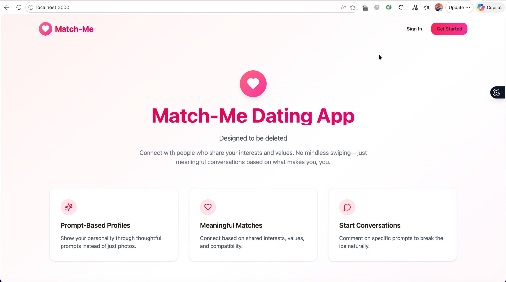
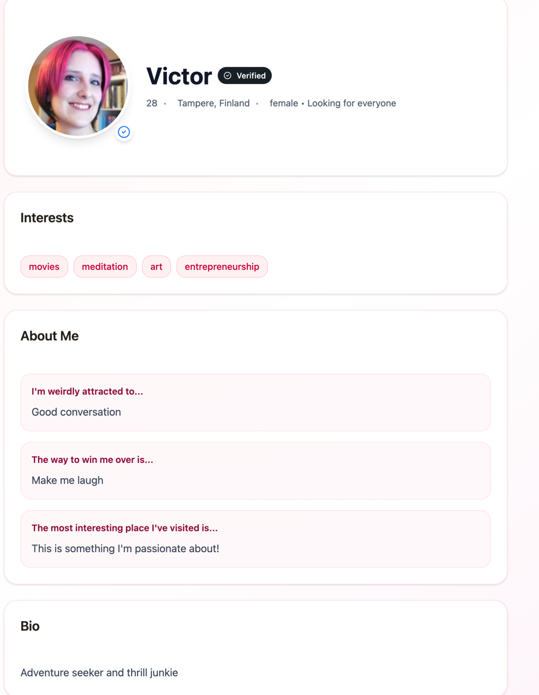

# Match-Me — Dating App

A prompt-based dating application that prioritizes meaningful connections over mindless swiping, using thoughtful matching algorithms and real-time interactions.

  
  
  

## Project Overview

Match-Me addresses the superficial nature of modern dating apps by shifting focus from appearance-first swiping to compatibility-driven matching. This project was built collaboratively as a team effort. Users create profiles through thoughtful prompts rather than photo galleries, and the app uses backend logic to surface connections based on shared values, interests, and conversation potential. The goal is to reduce the noise of endless swiping and help users find people they actually want to talk to.

## My Role & Technical Focus

My primary responsibility on this team project was the backend, built with a backend-first approach. The core challenge was designing robust matching logic that goes beyond simple filters—implementing hard constraints, compatibility scoring, and real-time state management. I focused heavily on data integrity, using PostgreSQL constraints and transactions to ensure user data remains consistent even during concurrent operations. The real-time features, powered by WebSockets, enable live updates for matches, messages, and profile views, creating a responsive experience that feels immediate rather than polling-based.

## Key Features

- **Prompt-based profiles** — Users answer questions instead of relying solely on photos
- **Intelligent matching algorithm** — Backend logic evaluates compatibility across multiple dimensions
- **Hard filters and preferences** — Enforced constraints ensure users only see relevant matches
- **Real-time notifications** — Live updates for new matches, messages, and profile interactions
- **Secure authentication** — User sessions and data protection throughout the application
- **Responsive discovery feed** — Dynamic matching results that update as preferences change

## Tech Stack

- **Backend:** Go (Gin)
- **Frontend:** React
- **Database:** PostgreSQL
- **Real-time / Infrastructure:** WebSockets, RESTful APIs

## What I Learned

Building Match-Me taught me to think about backend architecture before UI design. I learned that enforcing data integrity at the database level—using constraints, foreign keys, and transactions—is far more reliable than hoping application code catches every edge case. Working with real-time features forced me to think about state management across the entire system, not just the frontend. Most importantly, this project gave me experience building a non-trivial full-stack application end-to-end, from database schema design to user-facing features, and understanding how all the pieces fit together.

---

This project was developed collaboratively.

Source code is private due to course policy; available upon request.
